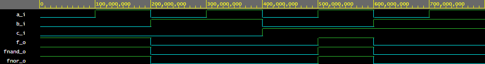
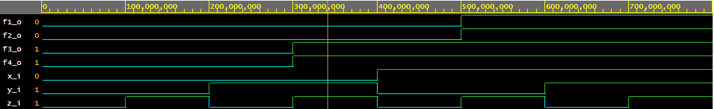

# Lab 1 - Gates

## Link to my GitHub

https://github.com/Nikodem-Pradka/Digital-electronics-1

## Implementace VHDL

```vhdl
library ieee;               -- Standard library
use ieee.std_logic_1164.all;-- Package for data types and logic operations

------------------------------------------------------------------------
-- Entity declaration for basic gates
------------------------------------------------------------------------
entity gates is
    port(
        a_i    : in  std_logic;         -- Data input
        b_i    : in  std_logic;         -- Data input
        c_i    : in  std_logic;         -- Data input
        f_o    : out std_logic;         -- OR output function
        fnand_o: out std_logic;
        fnor_o : out std_logic
        --fand_o : out std_logic;         -- AND output function
        --fxor_o : out std_logic          -- XOR output function
    );
end entity gates;

------------------------------------------------------------------------
-- Architecture body for basic gates
------------------------------------------------------------------------
architecture dataflow of gates is
begin
    f_o  <= ((not b_i) and a_i) or ((not c_i) and (not b_i));
    fnand_o <= not(not(not b_i and a_i) and not(not c_i and not b_i)); -- kdyz to zkusim zjednodusit tak se mi ty signaly rozhazi a nesedi a nemohu si prijit na chybu
    fnor_o <= not(b_i or not a_i) or not (c_i or b_i);
   --fand_o <= a_i and b_i;    --and nasobeni
    --fxor_o <= a_i xor b_i;   -- or scitani

end architecture dataflow;
```
## Image of De Morgan's law

nedaří se aby tady byl ale když ho otevřu v té složce images tak vypadá normálné. Jen tady nefunguje...



## Odkaz na Edaplaygroun

https://www.edaplayground.com/x/phtk

## Implementace VHDL - Distributive law

```vhdl

library ieee;               -- Standard library
use ieee.std_logic_1164.all;-- Package for data types and logic operations

------------------------------------------------------------------------
-- Entity declaration for basic gates
------------------------------------------------------------------------
entity gates is
    port(
        x_i    : in  std_logic;         -- Data input
        y_i    : in  std_logic;         -- Data input
        z_i	   : in	 std_logic;
        f1_o   : out std_logic;         
        f2_o   : out std_logic;
        f3_o   : out std_logic;
        f4_o   : out std_logic
	);
end entity gates;

------------------------------------------------------------------------
-- Architecture body for basic gates
------------------------------------------------------------------------
architecture dataflow of gates is
begin
    f1_o <= (x_i and y_i) or (x_i and z_i);
    f2_o <= x_i and (y_i or z_i);
    f3_o <= (x_i or y_i) and (x_i or z_i);
    f4_o <= x_i or (y_i and z_i);

end architecture dataflow;

```
## Image of Distributive law



## Odkaz na Edaplayground

https://www.edaplayground.com/x/LVdh