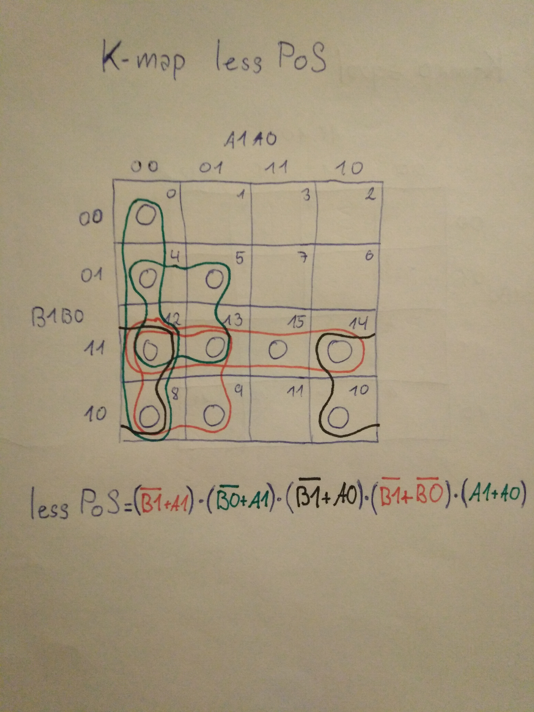
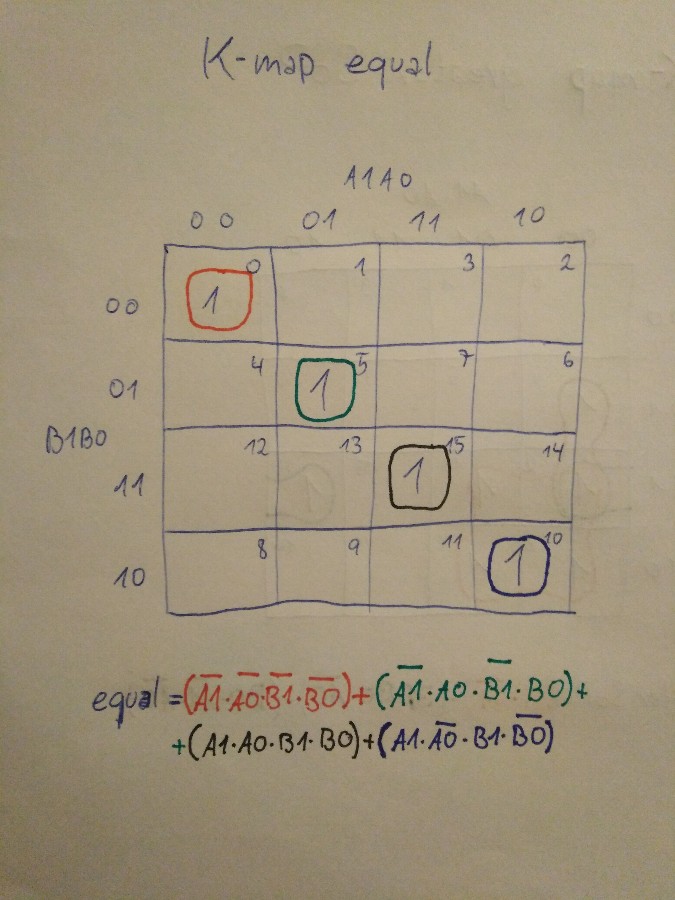
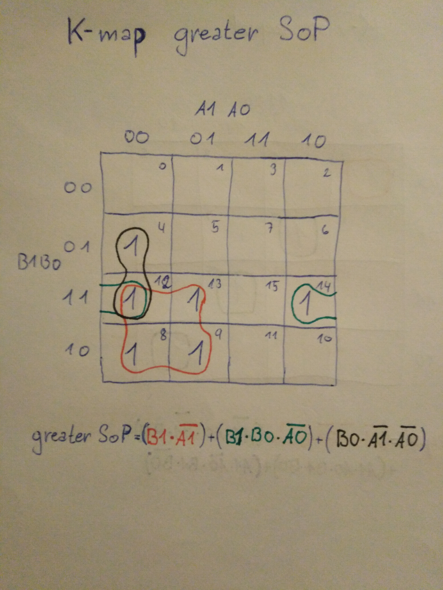

# Lab 2 - Combinational logic

## Truth table

| **Dec. equivalent** | **B[1:0]** | **A[1:0]** | **B is greater than A** | **B equals A** | **B is less than A** |
| :-: | :-: | :-: | :-: | :-: | :-: |
| 0 | 0 0 | 0 0 | 0 | 1 | 0 |
| 1 | 0 0 | 0 1 | 0 | 0 | 1 |
| 2 | 0 0 | 1 0 | 0 | 0 | 1 |
| 3 | 0 0 | 1 1 | 0 | 0 | 1 |
| 4 | 0 1 | 0 0 | 1 | 0 | 0 |
| 5 | 0 1 | 0 1 | 0 | 1 | 0 |
| 6 | 0 1 | 1 0 | 0 | 0 | 1 |
| 7 | 0 1 | 1 1 | 0 | 0 | 1 |
| 8 | 1 0 | 0 0 | 1 | 0 | 0 |
| 9 | 1 0 | 0 1 | 1 | 0 | 0 |
| 10 | 1 0 | 1 0 | 0 | 1 | 0 |
| 11 | 1 0 | 1 1 | 0 | 0 | 1 |
| 12 | 1 1 | 0 0 | 1 | 0 | 0 |
| 13 | 1 1 | 0 1 | 1 | 0 | 0 |
| 14 | 1 1 | 1 0 | 1 | 0 | 0 |
| 15 | 1 1 | 1 1 | 0 | 1 | 0 |

## 2-bit Comparator
### Karnaugh maps with equations





### Link to edaplayground
https://www.edaplayground.com/x/s4VY

## 4-bit Comparator

### Design vhdl
```vhdl
library ieee;
use ieee.std_logic_1164.all;

------------------------------------------------------------------------
-- Entity declaration for 4-bit binary comparator
------------------------------------------------------------------------
entity comparator_4bit is
    port(
        a_i           : in  std_logic_vector(4 - 1 downto 0); -- 4 signalizuje 4 vodice pro prehlednost 4 bity
        b_i           : in  std_logic_vector(4 - 1 downto 0);


        -- COMPLETE THE ENTITY DECLARATION


        B_less_A_o    : out std_logic;       -- B is less than A
        B_equals_A_o  : out std_logic;       -- B equals A
        B_greater_A_o : out std_logic        -- B is greater than A
    );
end entity comparator_4bit;

------------------------------------------------------------------------
-- Architecture body for 4-bit binary comparator
------------------------------------------------------------------------
architecture Behavioral of comparator_4bit is
begin
    B_less_A_o     <= '1' when (b_i < a_i) else '0';
    B_equals_A_o   <= '1' when (b_i = a_i) else '0';
    B_greater_A_o  <= '1' when (b_i > a_i) else '0';


    -- WRITE "GREATER" AND "EQUALS" ASSIGNMENTS HERE


end architecture Behavioral;

```
### Testbench vhdl
```vhdl
library ieee;
use ieee.std_logic_1164.all;

------------------------------------------------------------------------
-- Entity declaration for testbench
------------------------------------------------------------------------
entity tb_comparator_4bit is
    -- Entity of testbench is always empty
end entity tb_comparator_4bit;

------------------------------------------------------------------------
-- Architecture body for testbench
------------------------------------------------------------------------
architecture testbench of tb_comparator_4bit is

    -- Local signals
    signal s_a           : std_logic_vector(4 - 1 downto 0);
    signal s_b           : std_logic_vector(4 - 1 downto 0);
    signal s_B_greater_A : std_logic;
    signal s_B_equals_A  : std_logic;
    signal s_B_less_A    : std_logic;

begin
    -- Connecting testbench signals with comparator_4bit entity (Unit Under Test)
    uut_comparator_4bit : entity work.comparator_4bit
        port map(
            a_i           => s_a,
            b_i           => s_b,
            B_greater_A_o => s_B_greater_A,
            B_equals_A_o  => s_B_equals_A,
            B_less_A_o    => s_B_less_A
        );

    --------------------------------------------------------------------
    -- Data generation process
    --------------------------------------------------------------------
    p_stimulus : process
    begin
        -- Report a note at the beginning of stimulus process
        report "Stimulus process started" severity note;


        -- First test values
        s_b <= "0000"; s_a <= "0000"; wait for 100 ns;
        -- Expected output
        assert ((s_B_greater_A = '0') and (s_B_equals_A = '1') and (s_B_less_A = '0'))
        -- If false, then report an error
        report "Test failed for input combination: 0000, 0000" severity error;
        
        -- Second test values
        s_b <= "0000"; s_a <= "0100"; wait for 100 ns;
        assert ((s_B_greater_A = '0') and (s_B_equals_A = '0') and (s_B_less_A = '1'))
        report "Test failed for input combination: 0000, 0100" severity error;
        
        -- Third test values
        s_b <= "0100"; s_a <= "0100"; wait for 100 ns;
        assert ((s_B_greater_A = '0') and (s_B_equals_A = '1') and (s_B_less_A = '0'))
        report "Test failed for input combination: 0100, 0100" severity error;
        
        -- Fourth test values
        s_b <= "1100"; s_a <= "0000"; wait for 100 ns;
        assert ((s_B_greater_A = '1') and (s_B_equals_A = '0') and (s_B_less_A = '0'))
        report "Test failed for input combination: 1100, 0000" severity error;
        
        -- Fifth test values
        s_b <= "0100"; s_a <= "1000"; wait for 100 ns;
        assert ((s_B_greater_A = '0') and (s_B_equals_A = '0') and (s_B_less_A = '1'))
        report "Test failed for input combination: 0100, 1000" severity error;
        
        -- Sixth test values
        s_b <= "0100"; s_a <= "1100"; wait for 100 ns;
        assert ((s_B_greater_A = '0') and (s_B_equals_A = '0') and (s_B_less_A = '1'))
        report "Test failed for input combination: 0100, 1100" severity error;
        
        -- Seventh test values
        s_b <= "1100"; s_a <= "1100"; wait for 100 ns;
        assert ((s_B_greater_A = '0') and (s_B_equals_A = '1') and (s_B_less_A = '0'))
        report "Test failed for input combination: 1100, 1100" severity error;
        
        -- Eighth test values
        s_b <= "1100"; s_a <= "0100"; wait for 100 ns;
        assert ((s_B_greater_A = '1') and (s_B_equals_A = '0') and (s_B_less_A = '0'))
        report "Test failed for input combination: 1100, 0100" severity error;
        
        -- Nineth test values
        s_b <= "1100"; s_a <= "1000"; wait for 100 ns;
        assert ((s_B_greater_A = '1') and (s_B_equals_A = '0') and (s_B_less_A = '0'))
        report "Test failed for input combination: 1100, 1000" severity error;
        
        -- Tenth test values
        s_b <= "0100"; s_a <= "0000"; wait for 100 ns;
        assert ((s_B_greater_A = '1') and (s_B_equals_A = '0') and (s_B_less_A = '0'))
        report "Test failed for input combination: 0100, 0000" severity error;
        
        -- Tenth test values - MISTAKE
        s_b <= "0000"; s_a <= "1100"; wait for 100 ns;
        assert ((s_B_greater_A = '1') and (s_B_equals_A = '1') and (s_B_less_A = '1'))
        report "Test failed for input combination: 0000, 1100" severity error;
        
        -- WRITE OTHER TEST CASES HERE


        -- Report a note at the end of stimulus process
        report "Stimulus process finished" severity note;
        wait;
    end process p_stimulus;

end architecture testbench;


```

### Simulated error

### Link to edaplayground

https://www.edaplayground.com/x/XDKU
