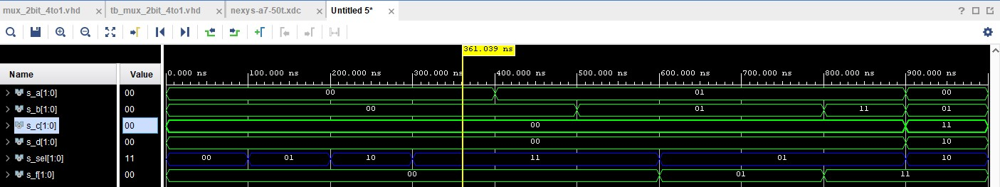
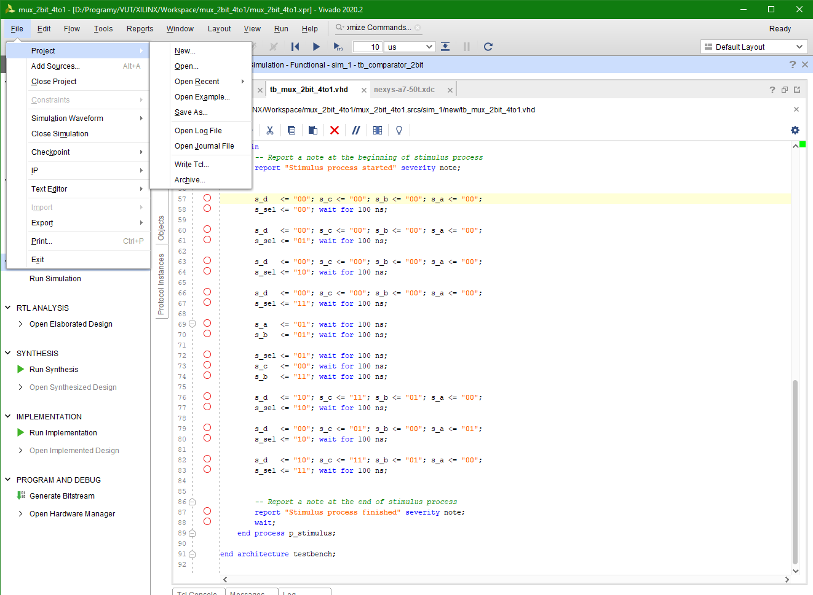
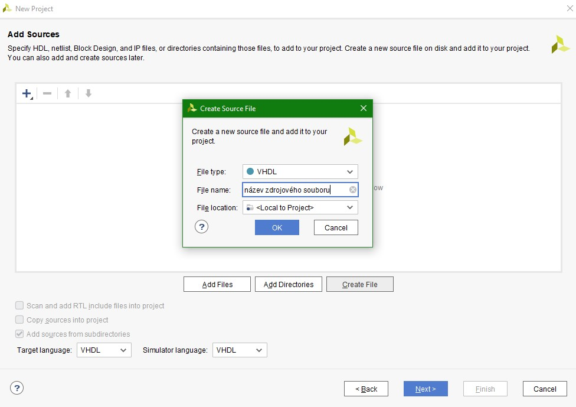
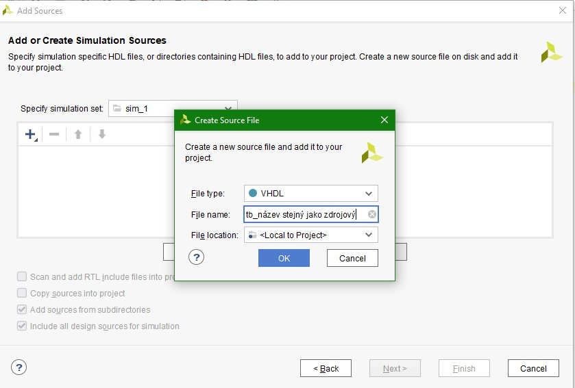
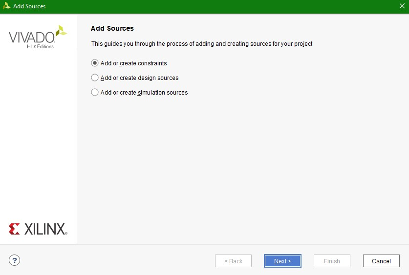
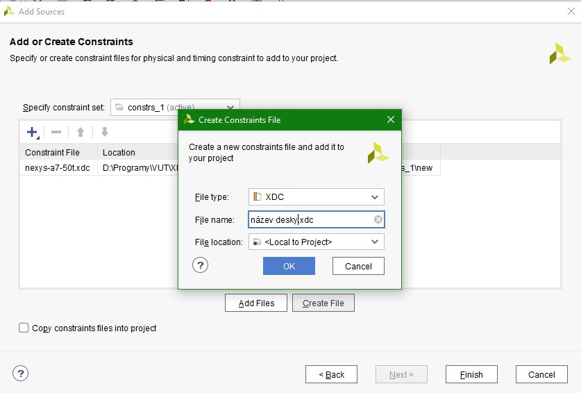
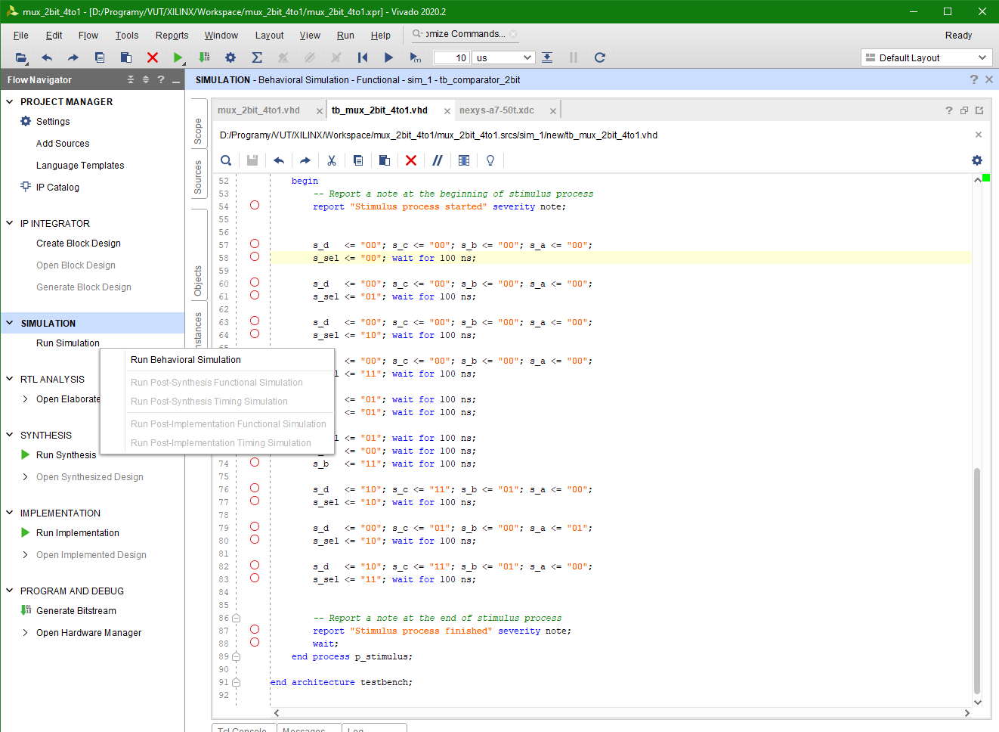

# Lab 3 - Vivado

## Table of connections

| **LED** | **Connection** | **Switch** | **Connection** | 
| :-: | :-: | :-: | :-: |
| LED0 | H17 | SW0 | J15 |
| LED1 | K15 | SW1 | L16 |
| LED2 | J13 | SW2 | M13 |
| LED3 | N14 | SW3 | R15 |
| LED4 | R18 | SW4 | R17 |
| LED5 | V17 | SW5 | T18 |
| LED6 | U17 | SW6 | U18 |
| LED7 | U16 | SW7 | R13 |
| LED8 | V16 | SW8 | T8 |
| LED9 | T15 | SW9 | U8 |
| LED10 | U14 | SW10 | R16 |
| LED11 | T16 | SW11 | T13 |
| LED12 | V15 | SW12 | H6 |
| LED13 | V14 | SW13 | U12 |
| LED14 | V12 | SW14 | U11 |
| LED15 | V11 | SW15 | V10 |


## Multiplexer 4
### Architecture
```vhdl
architecture Behavioral of mux_2bit_4to1 is
begin

   f_o <= a_i when (sel_i = "00") else
          b_i when (sel_i = "01") else
          c_i when (sel_i = "10") else
          d_i;


end architecture Behavioral;

```
### Stimulus proces
```vhdl
    p_stimulus : process
    begin
        -- Report a note at the beginning of stimulus process
        report "Stimulus process started" severity note;


        s_d   <= "00"; s_c <= "00"; s_b <= "00"; s_a <= "00"; 
        s_sel <= "00"; wait for 100 ns;

        s_d   <= "00"; s_c <= "00"; s_b <= "00"; s_a <= "00"; 
        s_sel <= "01"; wait for 100 ns;

        s_d   <= "00"; s_c <= "00"; s_b <= "00"; s_a <= "00"; 
        s_sel <= "10"; wait for 100 ns;

        s_d   <= "00"; s_c <= "00"; s_b <= "00"; s_a <= "00"; 
        s_sel <= "11"; wait for 100 ns; 
        
        s_a   <= "01"; wait for 100 ns;
        s_b   <= "01"; wait for 100 ns;
        
        s_sel <= "01"; wait for 100 ns;
        s_c   <= "00"; wait for 100 ns;
        s_b   <= "11"; wait for 100 ns;

        s_d   <= "10"; s_c <= "11"; s_b <= "01"; s_a <= "00";   
        s_sel <= "10"; wait for 100 ns;
        
        s_d   <= "00"; s_c <= "01"; s_b <= "00"; s_a <= "01";
        s_sel <= "10"; wait for 100 ns;
        
        s_d   <= "10"; s_c <= "11"; s_b <= "01"; s_a <= "00";
        s_sel <= "11"; wait for 100 ns;


        -- Report a note at the end of stimulus process
        report "Stimulus process finished" severity note;
        wait;
    end process p_stimulus;

end architecture testbench;
```
### Waveforms



## Tutorial
### Project creation

File -> Project -> New


Přídání zdrojového souboru, pojmenování


### Adding Testbench

File -> Add Sources -> Choose simulation sources a vhodně pojmenovat se začátkem tb_*



### Adding XDC Constraints file

File -> Add Sources -> Choose constraints sources a vložit název desky kterou chceme + na konci .xdc



### How to run simulation

On left side click Run Simulation -> Run Behavioral Simulation




