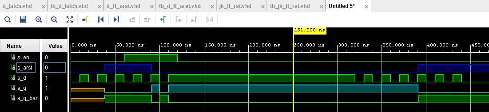

# Lab 7 - FFS

### Characteristic equations and tables for D, JK, T flip-flops

#### D-ff
Ta tabulka je asi špatně, nenašel jsem v prezentaci jak určit q(n), jen q(n+1)
   
   | **clk** | **d** | **q(n)** | **q(n+1)** |
   | :-: | :-: | :-: | :-: |
   |  | 0 | 0 | 0 |
   |  | 0 | 0 | 0 |
   |  | 1 | 1 | 1 |
   |  | 1 | 1 | 1 |

#### JK-ff
   
   | **clk** | **j** | **k** | **q(n)** | **q(n+1)** |
   | :-: | :-: | :-: | :-: | :-: |
   |  | 0 | 0 | 0 | 0 |
   |  | 0 | 0 | 1 | 1 |
   |  | 0 | 1 | 0 | 0 |
   |  | 0 | 1 | 1 | 0 |
   |  | 1 | 0 | 0 | 1 |
   |  | 1 | 0 | 1 | 1 |
   |  | 1 | 1 | 0 | 1 |
   |  | 1 | 1 | 1 | 0 |
   
#### T-ff
   
   | **clk** | **t** | **q(n)** | **q(n+1)** |
   | :-: | :-: | :-: | :-: |
   |  | 0 | 0 | 0 |
   |  | 0 | 1 | 1 |
   |  | 1 | 0 | 1 |
   |  | 1 | 1 | 0 |


## D latch

### VHDL code listing of the proces p_d_latch

```vhdl
    p_d_latch : process (d, arst, en)
    begin
        if(arst = '1') then
            q     <= '0';
            q_bar <= '1';
            
        elsif (en =  '1') then
            q     <= d;
            q_bar <= not d;    
            
        end if;
    end process p_d_latch;
```

### Listing of VHDL reset and stimulus processes from the testbench tb_d_latch
```vhdl
    p_reset_gen : process
    begin
        s_arst <= '0';
        wait for 38 ns;
        
        -- Reset activated
        s_arst <= '1';
        wait for 53 ns;

        -- Reset deactivated
        s_arst <= '0';
        
        wait for 300 ns;
        s_arst <= '1';

        wait;
    end process p_reset_gen;
    --------------------------------------------------------------------
    -- Data generation process
    --------------------------------------------------------------------
    --- WRITE YOUR CODE HERE
        p_stimulus : process
    begin
        report "Stimulus process started" severity note;
        s_d <= '0';
        s_en <= '0';
        
        assert(s_q = '0')
        report "s_q = 0 " severity error;
        
        --d sekv
        wait for 10 ns;
        s_d <= '1';
        wait for 10 ns;
        s_d <= '0';
        wait for 10 ns;
        s_d <= '1';
        wait for 10 ns;
        s_d <= '0';
        wait for 10 ns;
        s_d <= '1';
        wait for 10 ns;
        s_d <= '0';
        --/d sekv
        
        assert(s_q = '0' and s_q_bar = '1')
        report "s_q = '0' and s_q_bar = '1'" severity error;
        
        s_en <= '1';
        
        --d sekv
        wait for 10 ns;
        s_d <= '1';
        wait for 10 ns;
        s_d <= '0';
        wait for 10 ns;
        s_d <= '1';
        wait for 10 ns;
        s_d <= '0';
        wait for 10 ns;
        s_d <= '1';
        wait for 10 ns;
        s_en <= '0';       
        wait for 200 ns;
        s_d <= '0';
        --/d sekv
        
        --d sekv
        wait for 10 ns;
        s_d <= '1';
        wait for 10 ns;
        s_d <= '0';
        wait for 10 ns;
        s_d <= '1';
        wait for 10 ns;
        s_d <= '0';
        wait for 10 ns;
        s_d <= '1';
        wait for 10 ns;
        s_d <= '0';
        --/d sekv
        
        --d sekv
        wait for 10 ns;
        s_d <= '1';
        wait for 10 ns;
        s_d <= '0';
        wait for 10 ns;
        s_d <= '1';
        wait for 10 ns;
        s_d <= '0';
        wait for 10 ns;
        s_d <= '1';
        wait for 10 ns;
        s_d <= '0';
        --/d sekv
        

        report "Stimulus process finished" severity note;
        wait;
    end process p_stimulus;
```
### Screenshot of time waveforms


## Flip-flops

### VHDL code listing of the processes p_d_ff_arst, p_d_ff_rst, p_jk_ff_rst, p_t_ff_rst
#### d_ff_arst process
```vhdl
    p_d_ff_arst : process (clk, arst)
    begin
        if(arst = '1') then
            q     <= '0';
            q_bar <= '1';
            
        elsif rising_edge(clk) then
            q     <= d;
            q_bar <= not d;    
            
        end if;
    end process p_d_ff_arst;
```
#### tb_d_ff_arst process
```vhdl
    p_clk_gen : process
    begin
        while now < 750 ns loop         -- 75 periods of 100MHz clock
            s_clk_100MHz <= '0';
            wait for c_CLK_100MHZ_PERIOD / 2;
            s_clk_100MHz <= '1';
            wait for c_CLK_100MHZ_PERIOD / 2;
        end loop;
        wait;
    end process p_clk_gen;
    
    --------------------------------------------------------------------
    -- Reset generation process
    --------------------------------------------------------------------
    --- WRITE YOUR CODE HERE
    p_reset_gen : process
    begin
        s_arst <= '0';
        wait for 28 ns;
        
        -- Reset activated
        s_arst <= '1';
        wait for 13 ns;

        -- Reset deactivated
        s_arst <= '0';
        
        wait for 17 ns;
        s_arst <= '1';
        
        wait for 33 ns;
        s_arst <= '0';
        
        wait for 660 ns;
        s_arst <= '1';

        wait;
    end process p_reset_gen;
    --------------------------------------------------------------------
    -- Data generation process
    --------------------------------------------------------------------
    --- WRITE YOUR CODE HERE
        p_stimulus : process
    begin
        report "Stimulus process started" severity note;
        s_d <= '0';
        
        --d sekv
        wait for 14 ns;
        s_d <= '1';
        wait for 10 ns;
        s_d <= '0';
        wait for 10 ns;
        s_d <= '1';
        wait for 10 ns;
        s_d <= '0';
        wait for 10 ns;
        s_d <= '1';
        wait for 10 ns;
        s_d <= '0';
        --/d sekv
        
        --d sekv
        wait for 10 ns;
        s_d <= '1';
        wait for 10 ns;
        s_d <= '0';
        wait for 10 ns;
        s_d <= '1';
        wait for 10 ns;
        s_d <= '0';
        wait for 10 ns;
        s_d <= '1';
        wait for 10 ns;
        s_d <= '0';
        --/d sekv

        report "Stimulus process finished" severity note;
        wait;
    end process p_stimulus;
```
#### Waveforms


#### d_ff_rst process
```vhdl
    p_d_ff_rst : process (clk, rst)
    begin
        if rising_edge(clk) then
            if (rst = '1') then
                q     <= '0';
                q_bar <= '1';
                
            elsif rising_edge(clk) then
                q     <= d;
                q_bar <= not d;    
            end if;
        end if;
    end process p_d_ff_rst;


```
#### tb_d_ff_rst process
```vhdl
    p_clk_gen : process
    begin
        while now < 750 ns loop         -- 75 periods of 100MHz clock
            s_clk_100MHz <= '0';
            wait for c_CLK_100MHZ_PERIOD / 2;
            s_clk_100MHz <= '1';
            wait for c_CLK_100MHZ_PERIOD / 2;
        end loop;
        wait;
    end process p_clk_gen;
    
    --------------------------------------------------------------------
    -- Reset generation process
    --------------------------------------------------------------------
    --- WRITE YOUR CODE HERE
    p_reset_gen : process
    begin
        s_rst <= '0';
        wait for 28 ns;
        
        -- Reset activated
        s_rst <= '1';
        wait for 13 ns;

        -- Reset deactivated
        s_rst <= '0';
        
        wait for 17 ns;
        s_rst <= '1';
        
        wait for 33 ns;
        s_rst <= '0';
        
        wait for 660 ns;
        s_rst <= '1';

        wait;
    end process p_reset_gen;
    --------------------------------------------------------------------
    -- Data generation process
    --------------------------------------------------------------------
    --- WRITE YOUR CODE HERE
        p_stimulus : process
    begin
        report "Stimulus process started" severity note;
        s_d <= '0';
        
        --d sekv
        wait for 14 ns;
        s_d <= '1';
        wait for 10 ns;
        s_d <= '0';
        wait for 10 ns;
        s_d <= '1';
        wait for 10 ns;
        s_d <= '0';
        wait for 10 ns;
        s_d <= '1';
        wait for 10 ns;
        s_d <= '0';
        --/d sekv
        
        --d sekv
        wait for 10 ns;
        s_d <= '1';
        wait for 10 ns;
        s_d <= '0';
        wait for 10 ns;
        s_d <= '1';
        wait for 10 ns;
        s_d <= '0';
        wait for 10 ns;
        s_d <= '1';
        wait for 10 ns;
        s_d <= '0';
        --/d sekv

        report "Stimulus process finished" severity note;
        wait;
    end process p_stimulus;
```
#### Waveforms


#### jk_ff_rst process
```vhdl
architecture Behavioral of jk_ff_rst is
    signal s_q : std_logic;
begin

    p_jk_ff_rst : process (clk)
    begin
        if rising_edge(clk) then
            if (rst = '1') then
                s_q <= '0';
            else
                if (j = '0' and k = '0')then
                    s_q <= s_q;
                elsif (j = '0' and k = '1')then
                    s_q <= '0';
                elsif (j = '1' and k = '0')then
                    s_q <= '1';
                elsif (j = '1' and k = '1')then
                    s_q <= not s_q;
                end if;
            end if;
        
        end if;
    end process p_jk_ff_rst;
    
    q     <= s_q;
    q_bar <= not s_q;


end Behavioral;
```
#### tb_jk_ff_rst process
```vhdl
    p_clk_gen : process
    begin
        while now < 750 ns loop         -- 75 periods of 100MHz clock
            s_clk_100MHz <= '0';
            wait for c_CLK_100MHZ_PERIOD / 2;
            s_clk_100MHz <= '1';
            wait for c_CLK_100MHZ_PERIOD / 2;
        end loop;
        wait;
    end process p_clk_gen;
    
    --------------------------------------------------------------------
    -- Reset generation process
    --------------------------------------------------------------------
    --- WRITE YOUR CODE HERE
    p_reset_gen : process
    begin
        s_rst <= '0';
        wait for 28 ns;
        
        -- Reset activated
        s_rst <= '1';
        wait for 13 ns;

        -- Reset deactivated
        s_rst <= '0';
        
        wait for 17 ns;
        s_rst <= '1';
        
        wait for 33 ns;
        s_rst <= '0';
        
        wait for 660 ns;
        s_rst <= '1';

        wait;
    end process p_reset_gen;
    --------------------------------------------------------------------
    -- Data generation process
    --------------------------------------------------------------------
    --- WRITE YOUR CODE HERE
        p_stimulus : process
    begin
        report "Stimulus process started" severity note;
        s_j <= '0';
        s_k <= '0';
        
        --d sekv
        wait for 37 ns;
        s_j <= '0';
        s_k <= '0';
        wait for 3 ns;
        s_j <= '1';
        s_k <= '0';
        wait for 7 ns;
        s_j <= '0';
        s_k <= '1';
        wait for 14 ns;
        s_j <= '1';
        s_k <= '0';
        wait for 7 ns;
        s_j <= '1';
        s_k <= '1';
        
        wait for 7 ns;
        
        s_j <= '0';
        s_k <= '0';
        wait for 7 ns;
        s_j <= '0';
        s_k <= '1';
        wait for 7 ns;
        s_j <= '1';
        s_k <= '0';
        wait for 7 ns;
        s_j <= '1';
        s_k <= '1';
        

        report "Stimulus process finished" severity note;
        wait;
    end process p_stimulus;
```
#### Waveforms


#### t_ff_rst process
```vhdl
    p_t_ff_rst : process (clk, rst)
    begin
        if rising_edge(clk) then
            if (rst = '1') then
                s_q     <= '0';
                --q_bar <= '1';
            else    
                if (t = '0') then
                    s_q     <= s_q;
                    --q_bar <= not t;
                elsif (t = '1') then
                    s_q     <= not s_q;
                    --q_bar <= t;
                end if;    
            end if;
        end if;
    end process p_t_ff_rst;
    
    q     <= s_q;
    q_bar <= not s_q;
```
#### tb_t_ff_rst process
```vhdl
    p_reset_gen : process
    begin
        s_rst <= '0';
        wait for 15 ns;
        
        -- Reset activated
        s_rst <= '1';
        wait for 26 ns;

        -- Reset deactivated
        s_rst <= '0';
        wait for 13 ns;
        
        s_rst <= '1';
        wait for 22 ns;
        
        s_rst <= '0';
        wait;
    end process p_reset_gen;
    --------------------------------------------------------------------
    -- Data generation process
    --------------------------------------------------------------------
    --- WRITE YOUR CODE HERE
        p_stimulus : process
    begin
        report "Stimulus process started" severity note;
        s_t <= '0';
        
        --d sekv
        wait for 40 ns;
        s_t <= '1';
        wait for 40 ns;
        s_t <= '0';
        wait for 10 ns;
        s_t <= '1';
        wait for 10 ns;
        s_t <= '0';
        wait for 10 ns;
        s_t <= '1';
        wait for 10 ns;
        s_t <= '0';
        --/d sekv
        
        --d sekv
        wait for 10 ns;
        s_t <= '1';
        wait for 10 ns;
        s_t <= '0';
        wait for 10 ns;
        s_t <= '1';
        wait for 10 ns;
        s_t <= '0';
        wait for 10 ns;
        s_t <= '1';
        --/d sekv

        report "Stimulus process finished" severity note;
        wait;
    end process p_stimulus;
```
#### Waveforms


## Shift register

### Image of the shift register


