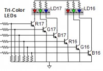
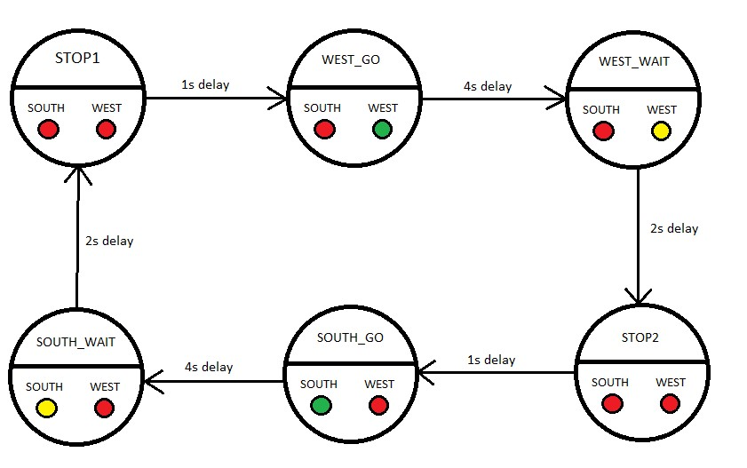
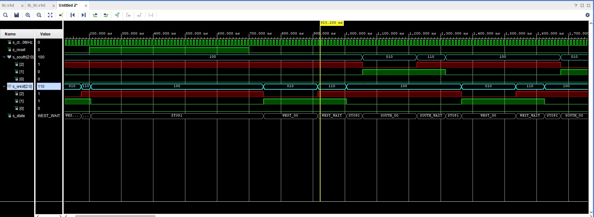
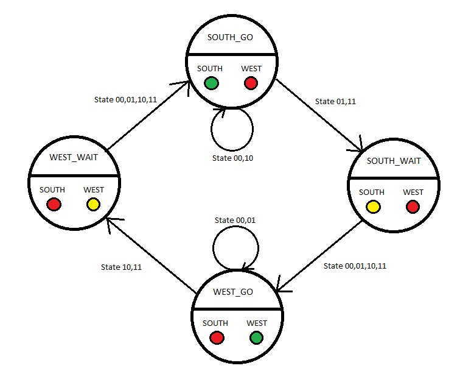

# Lab 8 - Traffic lights

### State table
| **Input P** | `0` | `0` | `1` | `1` | `0` | `1` | `0` | `1` | `1` | `1` | `1` | `0` | `0` | `1` | `1` | `1` |
| :-- | :-: | :-: | :-: | :-: | :-: | :-: | :-: | :-: | :-: | :-: | :-: | :-: | :-: | :-: | :-: | :-: |
| **Clock** |  |  |  |  |  |  |  |  |  |  |  |  |  |  |  |  |
| **State** | A | A | B | C | C | D | A | B | C | D | B | B | B | C | D | B |
| **Output R** | `0` | `0` | `0` | `0` | `0` | `1` | `0` | `0` | `0` | `1` | `0` | `0` | `0` | `0` | `1` | `0` |
### Connection of RGB LEDs and table 
| **RGB LED** | **Artix-7 pin names** | **Red** | **Yellow** | **Green** |
| :-: | :-: | :-: | :-: | :-: |
| LD16 | N15, M16, R12 | `1,0,0` | `1,1,0` | `0,1,0` |
| LD17 | N16, R11, G14 | `1,0,0` | `1,1,0` | `0,1,0` |



## Traffic light controller

### State Diagram

### Listing of VHDL code of sequential process p_traffic_fsm
```vhdl
    p_traffic_fsm : process(clk)
    begin
        if rising_edge(clk) then
            if (reset = '1') then       -- Synchronous reset
                s_state <= STOP1 ;      -- Set initial state
                s_cnt   <= c_ZERO;      -- Clear all bits

            elsif (s_en = '1') then
                -- Every 250 ms, CASE checks the value of the s_state 
                -- variable and changes to the next state according 
                -- to the delay value.
                case s_state is

                    -- If the current state is STOP1, then wait 1 sec
                    -- and move to the next GO_WAIT state.
                    when STOP1 =>
                        -- Count up to c_DELAY_1SEC
                        if (s_cnt < c_DELAY_1SEC) then
                            s_cnt <= s_cnt + 1;
                        else
                            -- Move to the next state
                            s_state <= WEST_GO;
                            -- Reset local counter value
                            s_cnt   <= c_ZERO;
                        end if;

                    when WEST_GO =>
                        if (s_cnt < c_DELAY_4SEC) then
                            s_cnt <= s_cnt + 1;
                        else
                            s_state <= WEST_WAIT;
                            s_cnt   <= c_ZERO;
                        end if;
                        
                    when WEST_WAIT =>
                        if (s_cnt < c_DELAY_2SEC) then
                            s_cnt <= s_cnt + 1;
                        else
                            s_state <= STOP2;
                            s_cnt   <= c_ZERO;
                        end if;
                        
                    when STOP2 =>
                        if (s_cnt < c_DELAY_1SEC) then
                            s_cnt <= s_cnt + 1;
                        else
                            s_state <= SOUTH_GO;
                            s_cnt   <= c_ZERO;
                        end if; 
                        
                    when SOUTH_GO =>
                        if (s_cnt < c_DELAY_4SEC) then
                            s_cnt <= s_cnt + 1;
                        else
                            s_state <= SOUTH_WAIT;
                            s_cnt   <= c_ZERO;
                        end if;
                        
                    when SOUTH_WAIT =>
                        if (s_cnt < c_DELAY_2SEC) then
                            s_cnt <= s_cnt + 1;
                        else
                            s_state <= STOP1;
                            s_cnt   <= c_ZERO;
                        end if;                                                                                               


                        -- WRITE YOUR CODE HERE


                    -- It is a good programming practice to use the 
                    -- OTHERS clause, even if all CASE choices have 
                    -- been made. 
                    when others =>
                        s_state <= STOP1;

                end case;
            end if; -- Synchronous reset
        end if; -- Rising edge
    end process p_traffic_fsm;
```
### Listing of VHDL code of combinatorial process p_output_fsm
```vhdl
    p_output_fsm : process(s_state)
    begin
        case s_state is
            when STOP1 =>
                south_o <= "100"; -- když jsem tu měl ty konstatny které jsou 
                west_o  <= "100"; -- definovány výše tak mi to s nimi nefungovalo
            when WEST_GO =>       -- nějak se ty 3 bity nezaměnily za název
                south_o <= "100";
                west_o  <= "010";
            when WEST_WAIT =>
                south_o <= "100";
                west_o  <= "110";
            when STOP2 =>
                south_o <= "100";
                west_o  <= "100";
            when SOUTH_GO =>
                south_o <= "010";
                west_o  <= "100";
            when SOUTH_WAIT =>
                south_o <= "110";
                west_o  <= "100";
                
                -- WRITE YOUR CODE HERE

            when others =>
                south_o <= "100";
                west_o  <= "100";
        end case;
    end process p_output_fsm;
```
### Screenshot


## Smart controller

### State table
| - | - | - | Input | Input | Input | Input |
| -- | -- | -- | -- | -- | -- | -- |
| States | States | States | No Cars | Cars to West | Cars to South | Cars both directions |
| Number | Name | Output | `00` | `01` | `10` | `11` |
| 0 | SOUTH_GO | 100 001 | SOUTH_GO | SOUTH_WAIT | SOUTH_GO | SOUTH_WAIT |
| 1 | SOUTH_WAIT | 100 110 | WEST_GO | WEST_GO | WEST_GO | WEST_GO |
| 2 | WEST_GO | 001 100 | WEST_GO | WEST_GO | WEST_WAIT | WEST_WAIT |
| 3 | WEST_WAIT | 110 100 | SOUTH_GO | SOUTH_GO | SOUTH_GO | SOUTH_GO |

### State diagram

### Listing of VHDL code of sequential process p_smart_traffic_fsm
```vhdl
    p_smart_traffic_fsm : process(clk)
    begin
        if rising_edge(clk) then
            if (reset = '1') then       -- Synchronous reset
                s_state <= STOP1 ;      -- Set initial state
                s_cnt   <= c_ZERO;      -- Clear all bits

            elsif (s_en = '1') then
                -- Every 250 ms, CASE checks the value of the s_state 
                -- variable and changes to the next state according 
                -- to the delay value.
                case s_senzor is
                    when S00 => -- no cars, south or west is open, depends ot state before
                        if (s_cnt < c_DELAY_4SEC) then
                            s_cnt <= s_cnt + 1;
                        elsif (s_state = SOUTH_GO) then
                            s_state <= SOUTH_GO;
                            s_cnt   <= c_ZERO;
                            
                        elsif (s_state = WEST_GO) then
                            s_state <= WEST_GO;
                            s_cnt   <= c_ZERO;
                            
                        elsif (s_state = SOUTH_WAIT) then
                            s_state <= WEST_GO;
                            s_cnt   <= c_ZERO;
                            
                        elsif (s_state = WEST_WAIT) then
                            s_state <= SOUTH_GO;
                            s_cnt   <= c_ZERO;                           
                        end if;
                    
                    when S01 => -- cars to west, switching until west is open
                        if (s_cnt < c_DELAY_4SEC) then
                            s_cnt <= s_cnt + 1;
                        elsif (s_state = WEST_GO) then
                            s_state <= WEST_GO;
                            s_cnt   <= c_ZERO;
                            
                        elsif (s_state = SOUTH_WAIT) then
                            s_state <= WEST_GO;
                            s_cnt   <= c_ZERO;    
                            
                        elsif (s_state = SOUTH_GO) then
                            s_state <= SOUTH_WAIT;
                            s_cnt   <= c_ZERO;
                        
                        elsif (s_state = WEST_WAIT) then
                            s_state <= SOUTH_GO;
                            s_cnt   <= c_ZERO;
                        end if;
                        
                    when S10 => -- cars to south, switching until south is open
                        if (s_cnt < c_DELAY_4SEC) then
                            s_cnt <= s_cnt + 1;
                        elsif (s_state = SOUTH_WAIT) then
                            s_state <= WEST_GO;
                            s_cnt   <= c_ZERO;
                            
                        elsif (s_state = WEST_GO) then
                            s_state <= WEST_WAIT;
                            s_cnt   <= c_ZERO;    
                            
                        elsif (s_state = WEST_WAIT) then
                            s_state <= SOUTH_GO;
                            s_cnt   <= c_ZERO;
                        
                        elsif (s_state = SOUTH_GO) then
                            s_state <= SOUTH_GO;
                            s_cnt   <= c_ZERO;   
                        end if;    
                        
                    when S11 => -- cars both directions, periodically switching throught all states
                        if (s_cnt < c_DELAY_4SEC) then
                            s_cnt <= s_cnt + 1;
                        elsif (s_state = SOUTH_GO) then
                            s_state <= SOUTH_WAIT;
                            s_cnt   <= c_ZERO;
                            
                        elsif (s_state = SOUTH_WAIT) then
                            s_state <= WEST_GO;
                            s_cnt   <= c_ZERO;    
                            
                        elsif (s_state = WEST_GO) then
                            s_state <= WEST_WAIT;
                            s_cnt   <= c_ZERO;
                        
                        elsif (s_state = WEST_WAIT) then
                            s_state <= SOUTH_GO;
                            s_cnt   <= c_ZERO;   
                        end if;    
                                            
                    when others =>
                            s_state <= STOP1;
                end case;
                
            end if; -- Synchronous reset
        end if; -- Rising edge
    end process p_smart_traffic_fsm;
```
